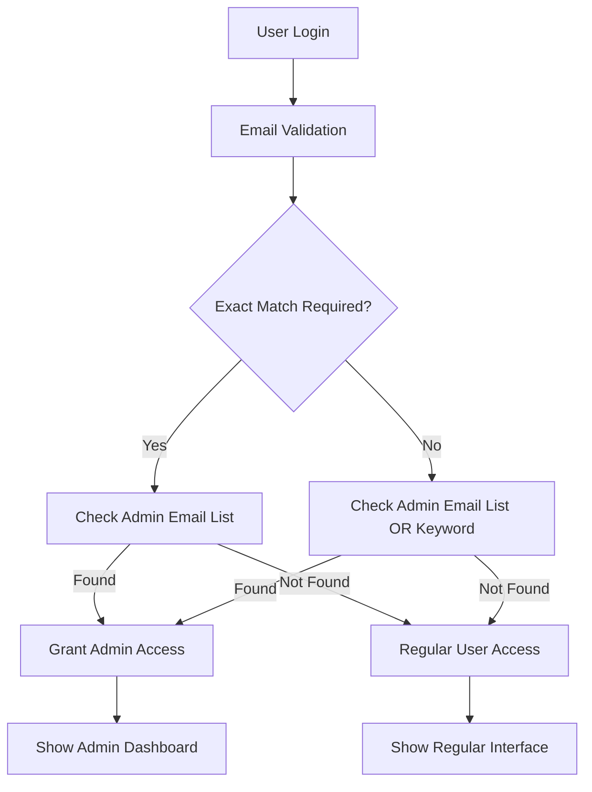

# Admin Email Management Guide for YdvMusic

## 📧 **Overview**

The YdvMusic application supports multiple methods for configuring admin email access, providing flexibility for different deployment scenarios and security requirements.

## 🔧 **Configuration Methods**

### **Method 1: Environment Variables (Recommended)**

Add the following configuration to your `.env` file:

```env
# Admin Configuration
# Comma-separated list of admin email addresses
VITE_ADMIN_EMAILS=admin@ydvmusic.com,admin@example.com,superadmin@ydvmusic.com,your-email@domain.com

# Admin Settings
VITE_ADMIN_REQUIRE_EXACT_MATCH=false
VITE_ADMIN_FALLBACK_KEYWORD=admin
```

### **Method 2: Using Admin Settings Panel**

1. Sign in as an existing admin
2. Navigate to **Admin Dashboard → Admin Settings**
3. Use the **Admin Email Manager** to:
   - Add/remove admin emails
   - Configure exact match requirements
   - Set fallback keywords
   - Test email access
   - Generate .env configuration

## ⚙️ **Configuration Options**

### **VITE_ADMIN_EMAILS**
- **Type**: Comma-separated string
- **Example**: `admin@ydvmusic.com,superadmin@example.com`
- **Description**: List of email addresses that should have admin access

### **VITE_ADMIN_REQUIRE_EXACT_MATCH**
- **Type**: Boolean (`true` or `false`)
- **Default**: `false`
- **Description**: 
  - `true`: Only emails in the VITE_ADMIN_EMAILS list will have admin access
  - `false`: Uses both email list AND keyword fallback

### **VITE_ADMIN_FALLBACK_KEYWORD**
- **Type**: String
- **Default**: `admin`
- **Description**: When exact match is disabled, emails containing this keyword will have admin access

## 🏗️ **Architecture Flow**



## 📋 **Adding Admin Emails**

### **Option 1: Direct .env Edit**

1. Open your `.env` file
2. Locate or add `VITE_ADMIN_EMAILS`
3. Add emails separated by commas:
   ```env
   VITE_ADMIN_EMAILS=admin@company.com,manager@company.com,super@company.com
   ```
4. Restart the development server

### **Option 2: Admin Settings Panel**

1. Sign in with an existing admin account
2. Go to **Admin Dashboard** (in sidebar)
3. Click **Admin Settings** tab
4. Use the **Admin Email Manager**:
   - Enter new email in the input field
   - Click **Add** button
   - Click **Copy Environment Configuration** to get updated .env content

### **Option 3: Quick Demo Access**

For testing purposes, use the demo admin account:
- **Email**: `admin@ydvmusic.com`
- **Password**: `admin123`

## 🧪 **Testing Admin Access**

### **Using the Email Tester**

1. Go to **Admin Dashboard → Admin Settings**
2. Scroll to **Test Email Access** section
3. Enter any email address
4. Click **Test** to see if it would have admin access
5. Results show: ADMIN/NOT ADMIN with reason

### **Manual Testing**

1. Sign out of your current account
2. Create a new account or sign in with the email you want to test
3. Check if "Admin Dashboard" appears in the sidebar
4. Look for the green "Admin Access Active" badge

## 🔒 **Security Considerations**

### **Production Recommendations**

1. **Use Exact Match**: Set `VITE_ADMIN_REQUIRE_EXACT_MATCH=true`
2. **Specific Emails**: List only necessary admin emails
3. **Remove Keyword Fallback**: Don't rely on keyword-based detection
4. **Regular Audits**: Periodically review admin email list

### **Development Setup**

1. **Keep Keyword Fallback**: Set `VITE_ADMIN_REQUIRE_EXACT_MATCH=false`
2. **Use Test Emails**: Include test admin accounts
3. **Document Access**: Keep track of who has admin access

## 📁 **File Structure**

```
src/
├── contexts/
│   └── AuthContext.tsx          # Admin email validation logic
├── components/
│   ├── AdminDashboard.tsx       # Main admin interface
│   ├── AdminEmailManager.tsx    # Email management UI
│   └── ProtectedRoute.tsx       # Admin route protection
└── utils/
    └── localData.ts             # User data management
```

## 🔧 **Technical Implementation**

### **Admin Email Validation Function**

```typescript
const isAdminEmail = (email: string): boolean => {
  const adminEmails = getAdminEmails();
  const requireExactMatch = import.meta.env.VITE_ADMIN_REQUIRE_EXACT_MATCH === 'true';
  const fallbackKeyword = import.meta.env.VITE_ADMIN_FALLBACK_KEYWORD || 'admin';
  
  const normalizedEmail = email.toLowerCase();
  
  // Check exact match against admin email list
  if (adminEmails.length > 0 && adminEmails.includes(normalizedEmail)) {
    return true;
  }
  
  // Fallback to keyword matching if exact match not required
  if (!requireExactMatch && fallbackKeyword) {
    return normalizedEmail.includes(fallbackKeyword);
  }
  
  return false;
};
```

### **Environment Variable Access**

```typescript
const getAdminEmails = (): string[] => {
  const adminEmails = import.meta.env.VITE_ADMIN_EMAILS || '';
  return adminEmails
    .split(',')
    .map((email: string) => email.trim().toLowerCase())
    .filter((email: string) => email.length > 0);
};
```

## 🚀 **Quick Start Examples**

### **Example 1: Single Admin**
```env
VITE_ADMIN_EMAILS=admin@yourcompany.com
VITE_ADMIN_REQUIRE_EXACT_MATCH=true
```

### **Example 2: Multiple Admins**
```env
VITE_ADMIN_EMAILS=admin@company.com,manager@company.com,super@company.com
VITE_ADMIN_REQUIRE_EXACT_MATCH=true
```

### **Example 3: Development Mode**
```env
VITE_ADMIN_EMAILS=admin@company.com,test.admin@example.com
VITE_ADMIN_REQUIRE_EXACT_MATCH=false
VITE_ADMIN_FALLBACK_KEYWORD=admin
```

## 🛠️ **Troubleshooting**

### **Admin Access Not Working**

1. **Check .env file**: Ensure `VITE_ADMIN_EMAILS` is set correctly
2. **Restart server**: Environment variables require restart
3. **Check email format**: Must be exact match (case-insensitive)
4. **Test with Admin Settings**: Use the built-in email tester

### **Environment Variables Not Loading**

1. **File location**: Ensure `.env` is in project root
2. **Prefix**: Environment variables must start with `VITE_`
3. **Syntax**: No spaces around `=` in `.env` file
4. **Restart**: Always restart dev server after .env changes

### **Admin Dashboard Not Appearing**

1. **Clear browser cache**: Force refresh the application
2. **Check console**: Look for JavaScript errors
3. **Verify admin status**: Use the email tester tool
4. **Try demo account**: Use `admin@ydvmusic.com` for testing

## 📞 **Support**

If you encounter issues with admin email configuration:

1. Use the **Admin Email Manager** in the dashboard for testing
2. Check the browser console for error messages
3. Verify your `.env` file syntax and content
4. Test with the provided demo admin account

---

*Last updated: Current implementation supports both environment variable configuration and UI-based management for maximum flexibility.*